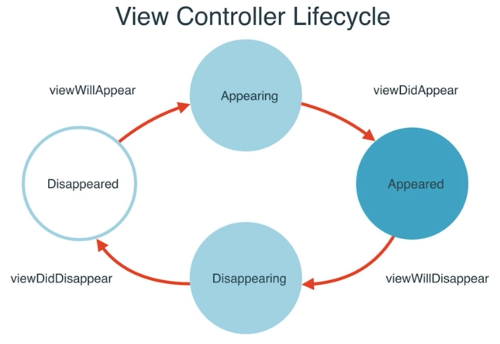

## ViewController and MultipleViews

*In iOS, `Will` is fired up before `Did` events*

**Segue** - connects one ViewController to another. To have control over what happens in between the views, hold down `control button` and drag a line to second ViewController in the Main.storyboard view manually.

### Class Extensions

`allows us to add code to a class, even though it resides in a different file`

### Deinitialization of the ViewControllers

`deinit` method of the ViewController class is called evertime the view is deinitialized (viewControllers are poped off the navigation stack). The method can be overriden to add extra steps:
	
	deinit {
		print("ViewController Deallocated.")
	} 