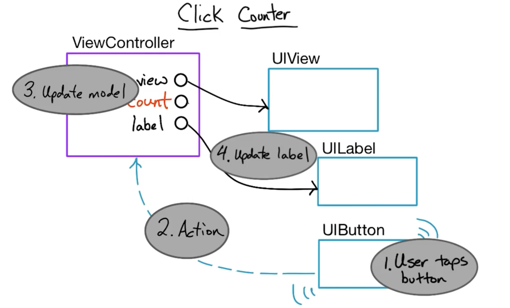
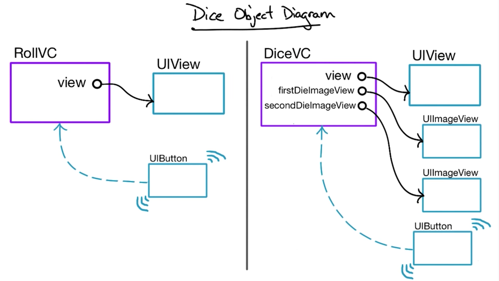
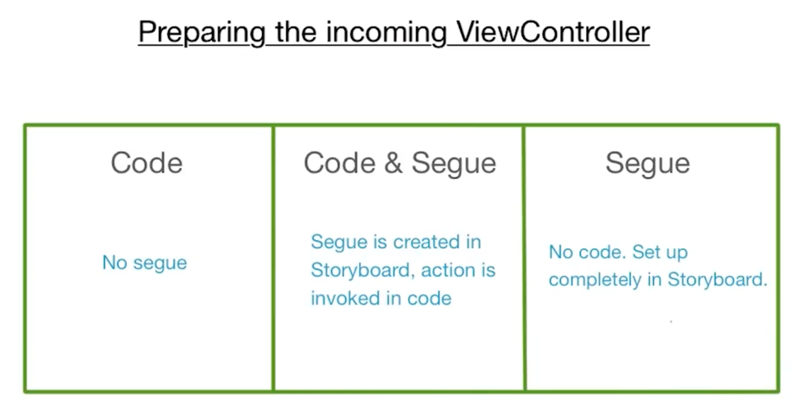

##Object Diagrams

All `ViewControllers` inherit a `view` property that points to a root view of the page.

###Simple App / Objects Diagram:

### Multiple Pages Apps

####What are the options that new pages of content make it on to the screen?

Two stock ways:

* (**N**) navigation structure (slides from right-to-left, with an always present back button in the top bar)
	* view contact chat (messages app)
* (**M**) modal presentation (views slide from the bottom of the screen. Often used for alert views)
	* new message screen (messages app)
	* camera attachement (messages app)

* **as `@IBAction` on the button with code:** 
		
		@IBAction func rollTheDice() {
		    var controller: DiceViewController
		    
		    controller = self.storyboard?.instantiateViewControllerWithIdentifier("DiceViewController") as!
		    DiceViewController
		    
		    controller.firstValue = self.randomDiceValue()
		    controller.secondValue = self.randomDiceValue()
		    
		    presentViewController(controller, animated: true, completion: nil)
		    
		    //dismiss() is used to remove the viewController and go back to the previous state of the application
		}
    
* **with`Segue` linked from controller to controller and code:**

		override func prepareForSegue(segue: UIStoryboardSegue, sender: AnyObject?) {
		    if segue.identifier == "rollDice" {
		        let controller = segue.destinationViewController as!
		        DiceViewController
		        controller.firstValue = self.randomDiceValue()
		        controller.secondValue = self.randomDiceValue()
		    }        
		}
		@IBAction func rollTheDice(){
		    performSegueWithIdentifier("rollDice", sender: self)
		}

* **with `Segue` linked directly from a button (as an action) to a second viewController and no code for transition, but code for sending arguments (same as above `prepareForSegue` method only)**

## UIKit Controllers

* UIImagePickerController
* UIActivityView
* UIAlertController