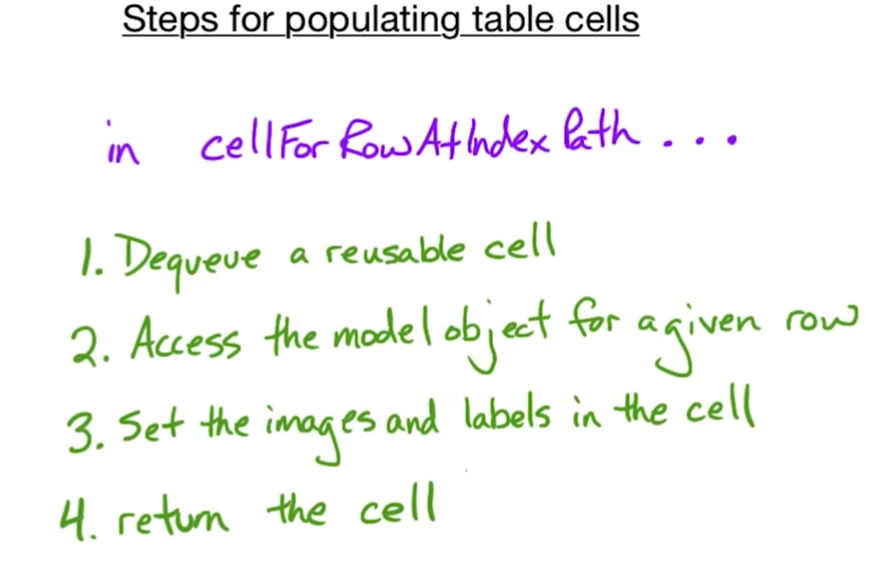

## NotificationCenter

- http://www.andrewcbancroft.com/2014/10/08/fundamentals-of-nsnotificationcenter-in-swift/
- https://www.andrewcbancroft.com/2015/02/05/nsnotificationcenter-vs-delegation-analysis/

> NSNotificationCenter is particularly useful when there are multiple class or struct instances that need to take action based on something that happens elsewhere in your application. For this type of scenario, NSNotificationCenter can be a great tool to wield as you develop apps in Swift for iOS.

## Deligate Pattern

> Deligate - an object that executes a group of methods on behalf of another object

The view establishes the questions that it needs answered and encodes that in a protocol. A **protocol** is a list of methods that a deligate must implement. **Any object that fulfills the protocol can become a deligate.**

### UITableView Delegates

Note: UITableView has 2 Delegate classes with the total of 44 methods.

- UITableViewDelegate
	- Governs responses to user events
		- What should happen when a button in a cell is tapped?
		- What should be the response to cell selection?
		- How should I respond when a user begins editing a row?
		- What should I respond when a user begins editing a row?
- UITableViewDataSource
	- Enables the table to access data in cells
		- How many rows do I have?
		- How many sections do I have?
		- What are the titles for the sections?
		- What is the cell view for each tow?

**UITableView Two Delegate Protocols main method:**

	func tableView(tableView: UITableView, canEditRowAtIndexPath indexPath: NSIndexPath) -> Bool

Is very simular to UITextField Delegate Protocol main method:

	func textField(textField: UITextField, shouldChangeCharactersInRange range: NSRange, replacementString string: String) -> Bool
	
`indexPath` argument is a struct with two members:

- row
- section

Essential methods in two protocols:

	//1
	func cellForRowAtIndexPath(_ indexPath: NSIndexPath) -> UITableViewController
	//2
	func tableView(_ tableView: UITableView,
					numberOfRowsInSection section: Int) -> Int
	//3
	func tableView(_ tableView: UITableView,
					didSelectRowAtIndexPath indexPath: NSIndexPath)

First two are DataSource Protocol methods. **They are the only required methods in that protocol.**

The third is used all the time to respond to the user selecting a row.

`cellForRowAtIndexPath` is used by the table view to get cell objects one at a time. The challange with the implimentation comes from optimization of this method for performance reasons.

>If we would be scrolling through a table where each data entry would have been represented by a single row (complex view object), we would have ended up with hundreds of objects to process and scroll through in a split second.

>INSTEAD Apple worked out a caching mechanism to reuse the cell objects over and over. Simular to steps on the escalator, when cell objects scroll of the screen, they get reused on the other side.

>Because of this we never need to construct the cells ourself. A few of them are kept in a queue in the `TableView`. If we need one, we just dequeue one from it, populate it with data and insert into a table.

> Some tables combine more than one type of cells. cell property `reuseIdentifier` is used for that.

