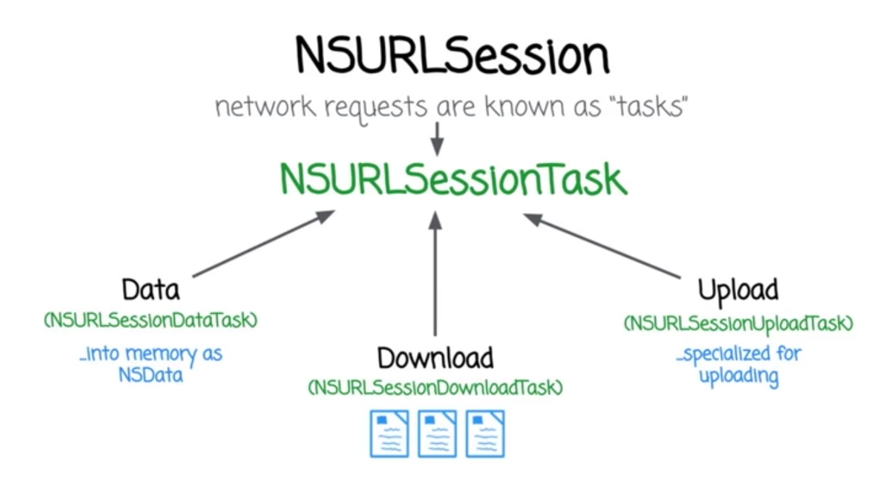

## iOS Networking

* __NSURL__
	* used to store location of a resource on a remote server
	* or the path of a local file on disk
	* use URLs for interapplication communication
* __NSURLRequest__
	* Wraps around NSURL to give us more granular control over the request itself
	* E.g.:

			let urlString = "https://www.google.com"
			let url = NSURL (string: urlString)!
			let request = NSURLRequest(URL: url)
			request.HTTPMethod = "GET"		//default

* __NSURLSession__
	* refers to requests as 'TASKS'
	* each NSURLSession task is a subclass of NSURLSessionTask

### ATS - App Transport Security
_Lets an app add a declaration to its Info.plist file that specifies the domains with which it needs (in)secure communication._
[More on ATS](https://ste.vn/2015/06/10/configuring-app-transport-security-ios-9-osx-10-11/)

## JSONSerialization

— a class used to convert bytes of JSON data into objects or vice versa

