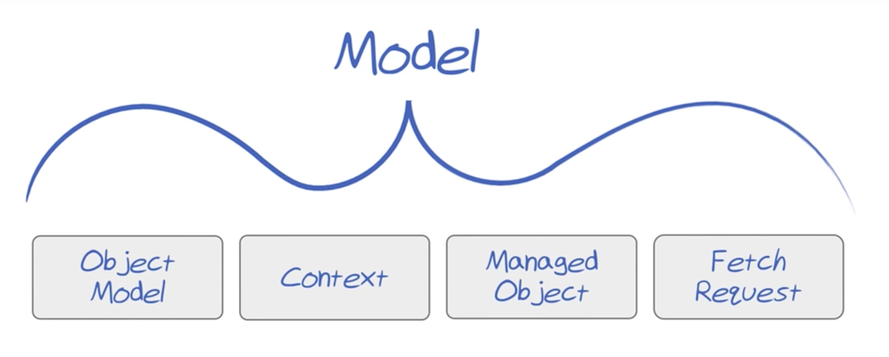
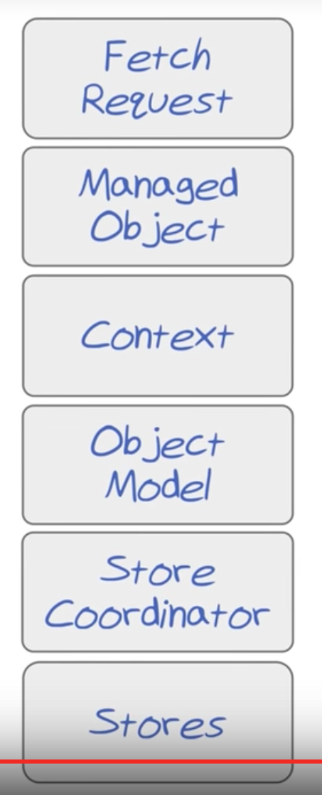
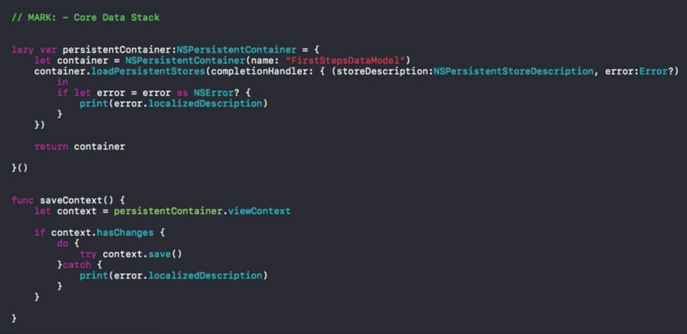

[Apple Developer Guide on Core Data](https://developer.apple.com/library/content/documentation/Cocoa/Conceptual/CoreData/index.html#//apple_ref/doc/uid/TP40001075)

> Core Data is a framework to help you manage the MODEL part of your app

### Core Data Stack

####Object Model (aka Managed Object Model aka Data Model)
* Physical representation of the model
* Exists in XCode as a special graphics file, simular to Storyboard
* Used to specify classes and relationships that will be managed within the app
* Used to generate tables and rows of the SQLite database
* Every single object of the Model will be a subclass of ManagedObject 

#### Managed Object

* **is a handler for an entitiy in Data Model [file]**, not a:
<del>
	* Representation of Entities in the Managed Object Model file
	* Handler to a table in the database
	* Instance of a class in code, used to interact with the db table
</del>
* is represented as an instance of a class (class is autogenerated as of Swift 3) that represents an entity from an Oject Model
*  handles saving the contents of its properties to a DB file (behind the scene)

####Managed Object Context (aka Context)
* Where managed objects live **until they are saved to disc**
* Where nearly all Core Data operations take place
	* Create / Delete / Save objects **all happen through Conext**

#### Fetch Request
* Used to find out who / what lives inside the `Context`
* _A fetch request is a search of a **context** for a certain type of **managed object**_
* Can specify:
	* type of managed object
	* filter
	* and how the resulting objects will be sorted 

>**NOTE:** _All of the above comprise a Model layer_

#### Fetched Results Controller
* part of controller layer
* controlls how data from a fetch request is displayed in the view
* takes a fetch request -> runs a search -> helps display the results
* **The most basic task is to keep the model and view in sync**
* If the objects returned by the fetch request change the fetch results controller automatically updates the table (or other view)

### At the lower level of Core Data:

#### Stores
* Where managed Objects are actually stored when saved to disk
* Can be thought of as database datafiles
* Can be of different types, e.g:
	* XML
	* Binary Format
	* SQLite (most common)
* **Note:** an app can how more than one `Store` or type of `Store`

#### Store Coordinator
* Allows you to have multiple `stores` and keeps the rest of the App from knowing it

### Core Data Stack:

#### Code changes needed to be added to AppDelegate.swift:

##### Swift 3:
