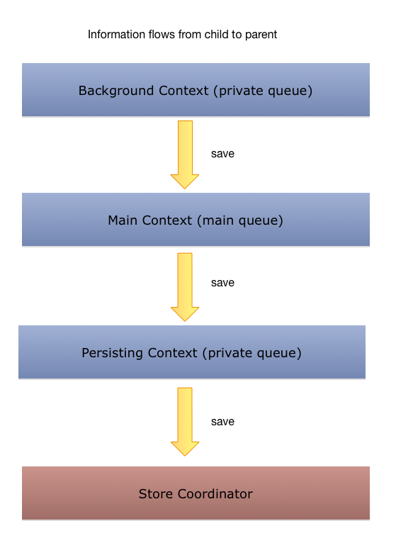

>Core Data same as UIKit is not thread-safe

### Two ways to achive concurrency are:

- <u>manual communication between contexts</u> (old)
	- requires you to create one separate managed context per thread or queue, e.g.:  _**Background Context** receives data from a web service and a **Front-End Context** displaying it to the user. (**Note**: you must notify the front-end context when new objects have arrived)_
- <u>parent-child contexts</u> (new)
	- Uses **Actor Design Pattern**: _When an object owns a queue and makes sure that all of its internal state runs in that queue._

### Parent-Child Context

<u>**Two things to understand:**</u>

 1. How to create a `NSManagedObjectContext` with its own queue
 2. Run code that uses the context in the correct queue

To **create NSManagedObjectContext** with its own queue we have to pass an appropriate constant when calling its init method:

- `.mainQueueConcurrencyType` - runs in the **main queue**
- `.privateQueueConcurrencyType` - runs in a queue that it will create by itself (**background**)

E.g:

	let mainContext = NSManagedObjectContext(concurrencyType: .mainQueueConcurrencyType)
	let backgroundContext = NSManagedObjectContext(concurrencyType: .privateQueueConcurrencyType)

-

You use contexts using the queue-based concurrency types in conjunction with `perform(_:)` and `performAndWait(_:)`

`perform(_:)` and `performAndWait(_:)` **ensures the block operations are executed on the queue specified for the context**.

- The `perform(_:)` method returns immediately and the context executes the block methods on its own thread. (simular to **async**)
- With the `performAndWait(_:)` method, the context still executes the block methods on its own thread, but the method doesn’t return until the block is executed. (simular to **sync**)

#### Finally onto the Parent-Child Context

#### Separate Context for Persisting (Saving)

